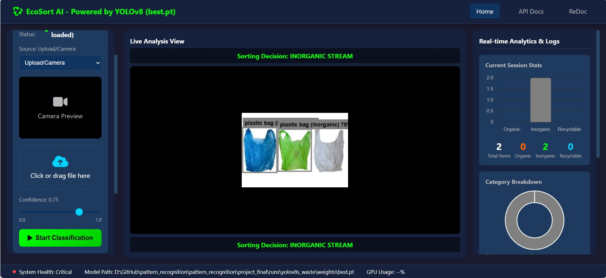
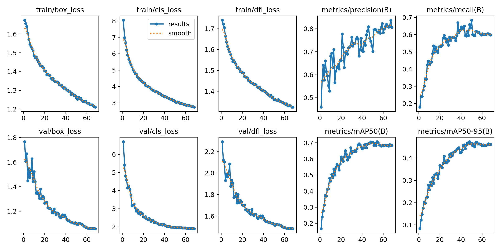
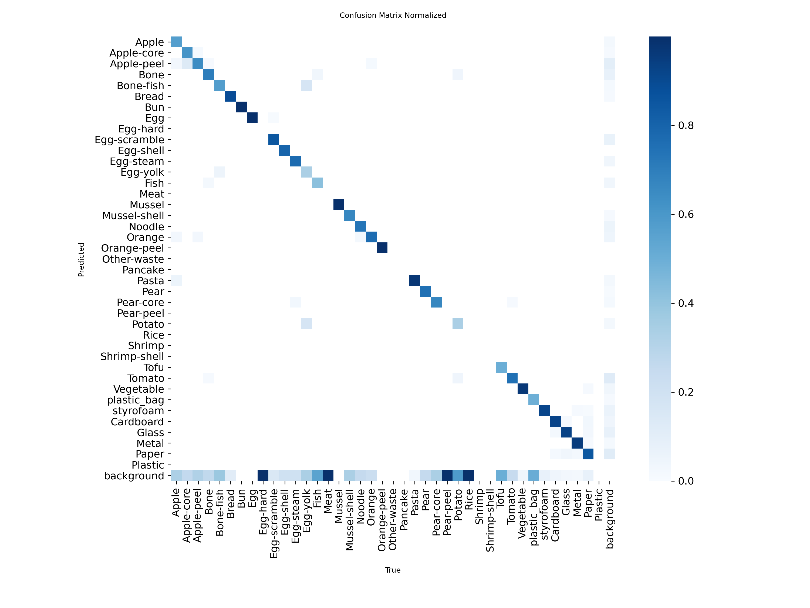
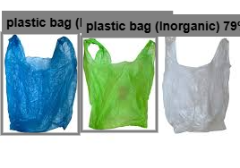

# EcoSort AI — Intelligent Waste Classification System

[](https://www.python.org/)
[](https://fastapi.tiangolo.com/)
[](https://ultralytics.com/)
[](LICENSE)

Real-time waste detection and sorting system powered by YOLOv8s. Classifies 39 waste types into 3 actionable categories through a full-stack FastAPI + Vanilla JS interface.

---

## Project Overview

EcoSort AI is an end-to-end system for intelligent waste sorting automation. It uses a custom-trained YOLOv8s object detection model — trained on Kaggle P100 GPU — to detect and classify waste items in real time from images, videos, or a live camera feed.

Key highlights:

- mAP@0.5 = **0.706** on validation set (YOLOv8s best checkpoint)
- Real-time inference via WebSocket streaming (~6 FPS on CPU)
- 39 fine-grained waste classes mapped to 3 operational categories
- Full-stack application: FastAPI backend (REST + WebSocket) with a Vanilla JS frontend
- Built-in analytics: live charts, detection log, CSV/Excel export



---

## System Architecture

```
+----------------------------------------------------------+
|                    FRONTEND (Browser)                     |
|   HTML5 + Vanilla JS + Chart.js + WebSocket API          |
|   Image/Video Upload | Live Camera | Real-time Charts    |
+----------------------+-----------------------------------+
                       | HTTP REST / WebSocket
+----------------------v-----------------------------------+
|                   BACKEND (FastAPI)                       |
|   ai_core.py       log_manager.py    system_monitor.py   |
|   (YOLO inference) (CSV/Excel logs)  (CPU/GPU/RAM)       |
|                                                           |
|         YOLOv8s Model — best.pt                          |
|         39 classes | 640x640 | conf=0.5 | iou=0.45      |
+----------------------------------------------------------+
```

---

## Project Structure

```
project_final/
├── Backend/
│   ├── app/
│   │   ├── __init__.py
│   │   ├── main.py              # FastAPI app, all API endpoints
│   │   ├── ai_core.py           # YOLOv8s model loading and inference
│   │   ├── config.py            # 39 class names, category mapping, thresholds
│   │   ├── image_processing.py  # Image decode/encode utilities
│   │   ├── log_manager.py       # Detection logging, CSV/Excel export
│   │   ├── schemas.py           # Pydantic request/response schemas
│   │   └── system_monitor.py    # CPU/GPU/RAM monitoring
│   ├── requirements.txt
│   └── run.py
├── Frontend/
│   ├── index.html               # Single-page application
│   ├── css/styles.css
│   └── js/app.js
├── notebook/
│   ├── EDA_trainyolov8n.ipynb
│   ├── waste_yolov8s.ipynb
│   ├── train_yolo11n.ipynb
│   └── evaluate-compare-yolov8s-yolo11n-yolov8n.ipynb
├── runs/
│   ├── yolov8s_waste/           # Production model artifacts
│   │   ├── weights/best.pt
│   │   ├── results.csv
│   │   └── confusion_matrix.png
│   ├── yolov8n_waste/
│   └── yolo11n_waste_optimized/
├── data.yaml
├── .gitignore
└── README.md
```

---

## Quick Start

### Prerequisites

- Python 3.10+
- A modern browser (Chrome, Firefox, Edge)

### 1. Clone and setup

```bash
git clone <your-repo-url>
cd project_final/Backend

python -m venv venv

# Windows
.\venv\Scripts\Activate.ps1

# Linux / macOS
source venv/bin/activate

pip install -r requirements.txt
```

### 2. Run the backend server

```bash
python run.py
```

The server starts at `http://localhost:8000`.  
Swagger UI: `http://localhost:8000/docs`  
ReDoc: `http://localhost:8000/redoc`

### 3. Open the frontend

Open `Frontend/index.html` in your browser, or use the VS Code Live Server extension.

The backend must be running before opening the frontend.

---

## Model Performance

### Training summary (Kaggle P100 GPU — 16 GB VRAM)

| Model | Params | Epochs | Train Time | mAP@0.5 | mAP@50-95 | Precision | Recall | Status |
|-------|--------|--------|------------|---------|-----------|-----------|--------|--------|
| YOLOv8s | 11.2M | 68 | ~5.2h | **0.706** | **0.471** | **0.809** | 0.622 | Production |
| YOLOv8n | 3.2M | 100 | ~4.7h | 0.651 | 0.412 | 0.764 | 0.598 | Compared |
| YOLO11n | 2.6M | 100 | ~3.8h | 0.668 | 0.428 | 0.771 | 0.611 | Compared |

All metrics are on the held-out validation set at `conf=0.5, iou=0.45, imgsz=640`.

YOLOv8s was selected because it achieves the best mAP across both metrics while still being practical for server/cloud deployment. The lighter models (YOLOv8n, YOLO11n) are more suitable for edge or mobile inference if needed.

### Training progression (YOLOv8s)

```
Epoch  1  ->  mAP@0.5: 0.166
Epoch 20  ->  mAP@0.5: 0.612
Epoch 40  ->  mAP@0.5: 0.663
Epoch 50  ->  mAP@0.5: 0.706   <- best.pt saved here
Epoch 68  ->  mAP@0.5: 0.685   (final epoch)
```



### Per-class accuracy (Normalized Confusion Matrix)



### Model configuration

```
Architecture : YOLOv8s (Small)
Input size   : 640 x 640
Batch size   : 16
Optimizer    : SGD (YOLO default)
Confidence   : 0.50
IoU (NMS)    : 0.45
Classes      : 39
Hardware     : Kaggle P100 GPU (16 GB VRAM)
```

---

## Waste Classification Scheme

The model detects 39 fine-grained classes that are then grouped into 3 operational categories:

| Category | Color | Classes | Intended Action |
|----------|-------|---------|-----------------|
| Organic | Orange (#FF6600) | 32 | Compost / Biogas |
| Inorganic | Gray (#808080) | 2 | Landfill stream |
| Recyclable | Green (#00FF00) | 5 | Recycling facility |

**Organic (IDs 0–31):**
Apple, Apple-core, Apple-peel, Bone, Bone-fish, Bread, Bun, Egg-hard, Egg-scramble, Egg-shell, Egg-steam, Egg-yolk, Fish, Meat, Mussel, Mussel-shell, Noodle, Orange, Orange-peel, Other-waste, Pancake, Pasta, Pear, Pear-core, Pear-peel, Potato, Rice, Shrimp, Shrimp-shell, Tofu, Tomato, Vegetable

**Inorganic (IDs 32–33):**
plastic_bag, styrofoam

**Recyclable (IDs 34–38):**
Cardboard, Glass, Metal, Paper, Plastic

---

## API Reference

Base URL: `http://localhost:8000`

### Prediction

| Method | Endpoint | Description |
|--------|----------|-------------|
| POST | `/predict/image` | Classify an uploaded image (JPG/PNG) |
| POST | `/predict/video` | Classify an uploaded video, frame by frame |
| POST | `/predict/frame` | Classify a single base64-encoded frame |
| WS | `/ws/stream` | WebSocket for live camera stream |

### System and logs

| Method | Endpoint | Description |
|--------|----------|-------------|
| GET | `/system/status` | CPU, RAM, GPU usage and model status |
| GET | `/system/classes` | List all 39 waste classes |
| GET | `/logs` | Detection history with optional filters |
| GET | `/logs/statistics` | Session summary stats |
| GET | `/logs/export/csv` | Download log as CSV |
| GET | `/logs/export/excel` | Download log as Excel (.xlsx) |
| DELETE | `/logs/clear` | Clear session logs |
| POST | `/snapshot` | Save current frame as JPEG |
| GET | `/snapshots` | List saved snapshots |

### Example request

```bash
curl -X POST "http://localhost:8000/predict/image?confidence=0.5&draw_boxes=false" \
  -F "file=@waste_image.jpg"
```

Example response:

```json
{
  "success": true,
  "detections": [
    {
      "id": 0,
      "class_name": "Apple-core",
      "category": "Organic",
      "confidence": 0.87,
      "bbox": { "x1": 120, "y1": 80, "x2": 260, "y2": 200 },
      "color": "#FF6600"
    }
  ],
  "sorting_decision": {
    "decision": "ORGANIC_STREAM",
    "signal": "RED",
    "organic_count": 1,
    "inorganic_count": 0,
    "recyclable_count": 0,
    "total_count": 1
  },
  "inference_time_ms": 42.3
}
```

---

## Features

### Frontend

- Image upload (drag-and-drop or file picker) — JPG, PNG, JPEG
- Video upload (MP4/AVI), processed every 5 frames (~6 effective FPS)
- Live camera stream with real-time bounding box overlay via WebSocket
- Color-coded bounding boxes by category, showing class name and confidence
- Confidence threshold slider (0.0 to 1.0)
- Category filter toggle (Organic / Inorganic / Recyclable)
- Live bar chart (counts) and doughnut chart (category ratio)
- Searchable detection log with timestamps
- One-click export to CSV or Excel
- Snapshot: save the current annotated frame as JPEG
- Sorting signal indicator (traffic-light style)



### Backend

- Smart model loading — loads `best.pt` automatically, falls back to pretrained weights
- CUDA GPU used if available, CPU otherwise
- Thread-safe detection logging with `threading.Lock`
- CSV and Excel export with a separate Statistics sheet
- Async WebSocket streaming for real-time inference
- System health monitoring (RAM/CPU/GPU) with warning thresholds

---

## Dataset

| Property | Value |
|----------|-------|
| Source | Custom merged dataset (Kaggle) |
| Format | YOLO annotation format (.txt labels) |
| Split | Train / Validation / Test |
| Classes | 39 |
| Image format | JPG, PNG |
| Config file | `data.yaml` |

Classes were merged from multiple sources and mapped to 3 operational categories in `config.py`.

---

## Development Notes

**Singleton pattern for backend modules:**

```python
from .ai_core import ai_core               # single YOLO model instance
from .log_manager import log_manager       # thread-safe log store
from .system_monitor import system_monitor # hardware monitor
```

**Category boundaries defined in `config.py`:**

```python
ORGANIC_CLASSES    = [...]  # IDs 0–31  (32 food/kitchen waste classes)
INORGANIC_CLASSES  = [...]  # IDs 32–33 (plastic_bag, styrofoam)
RECYCLABLE_CLASSES = [...]  # IDs 34–38 (Cardboard, Glass, Metal, Paper, Plastic)
```

**CORS:** Currently set to `allow_origins=["*"]` for local development. For production, restrict to your specific domain.

---

## Dependencies

```
fastapi>=0.104.0
uvicorn[standard]>=0.24.0
ultralytics>=8.0.200
opencv-python>=4.8.0
numpy>=1.26.0
pillow>=10.0.0
pandas>=2.1.0
openpyxl>=3.1.0
psutil>=5.9.0
GPUtil>=1.4.0
websockets>=12.0
aiofiles>=23.0.0
python-multipart>=0.0.6
```

---

## License

This project is licensed under the MIT License.
